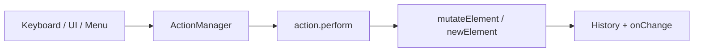

# Action System

Actions are the editor's command pattern for user operations. They live in `packages/excalidraw/actions/`.

## Architecture



### Registration

`actions/register.ts` collects all actions. `ActionManager` dispatches based on:

- Keyboard shortcuts (`actions/shortcuts.ts`)
- UI button clicks
- Command palette entries
- Context menu items

### Action shape

```ts
type Action = {
  name: ActionName;
  label: string | ((elements, appState, app) => string);
  icon?: React.ReactNode;
  PanelComponent?: React.FC;
  perform: (
    elements: readonly ExcalidrawElement[],
    appState: AppState,
    formData: any,
    app: AppClassProperties,
  ) => ActionResult;
  keyTest?: (event: KeyboardEvent) => boolean;
  predicate?: (elements, appState, app) => boolean;
};
```

`ActionResult` can return updated `elements`, `appState`, `commitToHistory`, and `appStateIncrement`.

## Action categories

### Selection & editing

| Action | File | Shortcut (typical) |
| --- | --- | --- |
| Select all | `actionSelectAll.ts` | Ctrl+A |
| Deselect | `actionDeselect.ts` | Escape |
| Delete selected | `actionDeleteSelected.ts` | Delete |
| Duplicate | `actionDuplicateSelection.ts` | Ctrl+D |
| Copy / Cut / Paste | `actionClipboard.ts` | Ctrl+C/X/V |
| Group / Ungroup | `actionGroup.ts` | Ctrl+G / Ctrl+Shift+G |

### Properties

| Action | File |
| --- | --- |
| Change stroke color | `actionProperties.ts` |
| Change background color | `actionProperties.ts` |
| Change stroke width | `actionProperties.ts` |
| Change fill style | `actionProperties.ts` |
| Change opacity | `actionProperties.ts` |
| Change font size/family | `actionProperties.ts` |
| Change text align | `actionProperties.ts` |
| Change arrow properties | `actionProperties.ts` |
| Copy/paste styles | `actionStyles.ts` |

### Canvas

| Action | File |
| --- | --- |
| Zoom in/out/reset | `actionCanvas.ts` |
| Zoom to fit | `actionCanvas.ts` |
| Toggle theme | `actionCanvas.ts` |
| Change background | `actionCanvas.ts` |
| Clear canvas | `actionCanvas.ts` |

### Z-order

| Action | File |
| --- | --- |
| Bring forward / to front | `actionZindex.ts` |
| Send backward / to back | `actionZindex.ts` |

### Alignment & distribution

| Action | File |
| --- | --- |
| Align top/bottom/left/right/center | `actionAlign.ts` |
| Distribute horizontally/vertically | `actionDistribute.ts` |

### Export & files

| Action | File |
| --- | --- |
| Save to disk | `actionExport.ts` |
| Load scene | `actionExport.ts` |
| Export PNG/SVG | `actionClipboard.ts` |
| Save to active file | `actionExport.ts` |

### Collaboration

| Action | File |
| --- | --- |
| Go to collaborator | `actionNavigate.ts` |

### Other

| Action | File |
| --- | --- |
| Flip horizontal/vertical | `actionFlip.ts` |
| Add to library | `actionAddToLibrary.ts` |
| Toggle search menu | `actionToggleSearchMenu.ts` |
| Frame operations | `actionFrame.ts` |
| Element lock | `actionElementLock.ts` |
| Element link | `actionElementLink.ts` |
| Text auto-resize | `actionTextAutoResize.ts` |
| Embeddable tool | `actionEmbeddable.ts` |
| Finalize (finish drawing) | `actionFinalize.ts` |

## Custom actions

Host apps can register custom actions via the imperative API:

```ts
excalidrawAPI.registerAction(myCustomAction);
```

## WebXDC impact

Most actions work unchanged in WebXDC. Disabled features affect action availability indirectly:

- Mermaid paste → stubbed in `App.tsx` transform
- Chart paste → stubbed
- TTD (text-to-diagram) → stub component
- Export dialogs → null component stub

The WebXDC main menu exposes a subset: search, insert image, help, clear, preferences, theme, background.