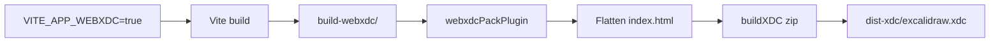

# Build & Deploy

## Build targets

| Target | Command | Output |
| --- | --- | --- |
| WebXDC package | `make build-webxdc` | `excalidraw-app/dist-xdc/excalidraw.xdc` |
| Standard app | `bun run build` | `excalidraw-app/build/` |
| npm packages | `bun run build:packages` | `packages/*/dist/` |
| Preview | `bun run build:preview` | Serves `build/` on port 5000 |

## WebXDC build pipeline



### Step-by-step

1. **Vite entry**: `webxdc/index.html` (not root `index.html`)
2. **Slim transforms** (`webxdcSlimPlugin`):
   - Resolve heavy imports to stubs
   - Strip i18n to English
   - Remove optional fonts
   - Delete excluded assets from bundle
3. **esbuild options**: drop `console`/`debugger`, no legal comments
4. **Single bundle**: `inlineDynamicImports: true`
5. **Pack plugin** (`webxdcPackPlugin`):
   - Move `webxdc/index.html` → `index.html`
   - Fix relative paths (`../` → ``)
   - Ensure `<script src="webxdc.js">` loads before app module
   - Copy `manifest.toml` with version
   - Copy `webxdc-stub.js` as `webxdc.js`
6. **Zip** (`buildXDC` from `@webxdc/vite-plugins`):
   - Filter files via `webxdcZipFilter`
   - Output `excalidraw.xdc`

### Version injection

```bash
# Makefile sets version in manifest.toml and passes WEBXDC_VERSION
make build-webxdc WEBXDC_VERSION=1.0.5
```

Injected as:
- `import.meta.env.VITE_WEBXDC_VERSION` in app code
- `version` field in packaged `manifest.toml`

## Standard app build

```bash
bun run build
# = build:app + build:version
```

- `build:app`: Vite production build with tracking enabled
- `build:version`: Writes version metadata via `scripts/build-version.js`

Output: `excalidraw-app/build/` with PWA service worker, sitemap, chunked locales.

## Package builds (esbuild)

Each package has `build:esm` script using shared build infrastructure:

| Package | Script | Builder |
| --- | --- | --- |
| common, element, math, fractional-indexing, laser-pointer | `buildBase.js` | esbuild |
| excalidraw | `buildPackage.js` | esbuild + sass |
| utils | `buildUtils.js` | esbuild |

```bash
bun run build:packages
```

Produces for each package:
- `dist/dev/` — development build
- `dist/prod/` — production build
- `dist/types/` — TypeScript declarations

Env vars parsed from `.env.development` / `.env.production` via `packages/excalidraw/env.cjs`.

## Vite configuration highlights

File: `excalidraw-app/vite.config.mts`

### Shared (both modes)

- React plugin, SVGR, EJS HTML, woff2 browser plugin
- Path aliases to package source
- `publicDir: "../public"`
- `assetsInlineLimit: 0` (fonts not inlined)

### WebXDC-only

- `base: "./"` for relative asset paths in zip
- Stub aliases for sentry, firebase, socket.io, mermaid
- `virtual:pwa-register` → `pwa-stub.ts`
- No PWA, sitemap, or ESLint checker plugins
- `outDir: build-webxdc`

### Standard-only

- PWA with Workbox caching strategies
- Sitemap generation
- TypeScript + ESLint checker overlay
- Manual chunks for locales, CodeMirror, mermaid
- Source maps enabled

## Output artifacts

### WebXDC (.xdc contents)

```
excalidraw.xdc (zip)
├── index.html          # Entry with webxdc.js + app bundle
├── manifest.toml       # App metadata
├── webxdc.js           # Stub (host replaces at runtime)
├── assets/             # JS/CSS bundle
├── fonts/
│   ├── Virgil/         # Hand-drawn font
│   └── Assistant/      # UI font
└── android-chrome-192x192.png  # Icon
```

### Ignored from zip

Screenshots, extra fonts, locale chunks, service worker, promo images, CodeMirror, mermaid, KaTeX, etc. — see `webxdcZipFilter` and `EXCLUDED_ASSET_PATTERNS` in `vite-slim-plugin.mts`.

## Clean builds

```bash
bun run rm:build          # Remove all build/dist dirs
make clean                # Remove WebXDC output only
bun run clean-install     # Full reinstall
```

`.gitignore` excludes:
- `excalidraw-app/build-webxdc/`
- `excalidraw-app/dist-xdc/`
- `*.xdc`

## Deploying WebXDC

1. Build: `make build-webxdc`
2. Distribute `excalidraw-app/dist-xdc/excalidraw.xdc`
3. Users attach to Delta Chat conversation
4. No server required — sync is entirely peer-to-peer via Delta Chat

## Deploying standard app

The standard app targets static hosting (Vercel, etc.):

```bash
bun run build
# Deploy excalidraw-app/build/
```

Requires environment configuration for Firebase collaboration backend.