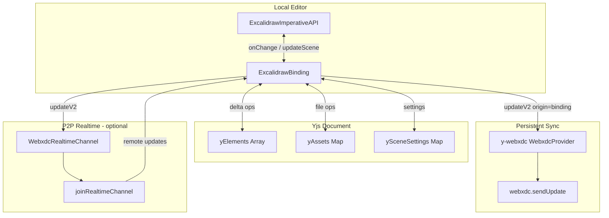

# Collaboration & Sync

WebXDC Excalidraw uses a **dual-layer sync** model: persistent chat-backed sync plus optional P2P realtime.

## Overview



## Layer 1: Persistent sync (sendUpdate)

**Library:** [y-webxdc](https://github.com/webxdc/y-webxdc)  
**Transport:** Delta Chat `sendUpdate` / `setUpdateListener`

Every drawing change is converted to Yjs updates and periodically persisted to the chat as status updates. New participants replay the full history via `setUpdateListener`.

### Flow

1. `WebxdcCollab` creates a `Y.Doc` with shared types:
   - `elements` — `Y.Array<Y.Map>` of element properties
   - `assets` — `Y.Map` of embedded image data
   - `sceneSettings` — `Y.Map` of background color, grid, etc.

2. `WebxdcProvider` (from y-webxdc) serializes Yjs updates and calls `webxdc.sendUpdate()`

3. On join, `setUpdateListener` replays all prior updates before the editor becomes interactive

4. `ExcalidrawBinding` bridges the Excalidraw API ↔ Yjs:
   - Local changes → delta operations → Yjs (origin = binding)
   - Remote Yjs changes → `yjsToExcalidraw` → `api.updateScene()`

### Timing constants

Defined in `webxdc/constants.ts`:

| Constant | Value | Purpose |
| --- | --- | --- |
| `REALTIME_DOC_MS` | 80ms | Throttle live Yjs over P2P |
| `PERSIST_FLUSH_MS` | 500ms | Throttle sendUpdate while drawing |
| `PERSIST_SCENE_SYNC_MS` | 3000ms | Minimum autosave interval |

Image assets bypass realtime (too large) and trigger immediate `syncToChatPeers()`.

### Edit info

Status updates include metadata for the chat UI:

```ts
{
  document: "Excalidraw",
  summary: `Last edit: ${selfName}`,
  startinfo: `${selfName} edited the whiteboard`,
}
```

## Layer 2: P2P realtime (optional)

**Class:** `WebxdcRealtimeChannel` (`webxdc-realtime-channel.ts`)  
**Transport:** Delta Chat `joinRealtimeChannel()` (requires Delta Chat 1.48+)

When available, live drawing and cursors sync over a peer-to-peer channel without waiting for `sendUpdate` round-trips.

### Message types

| Type | Payload | Purpose |
| --- | --- | --- |
| `pos` | x, y, button, tool, user colors | Cursor position (~30 fps) |
| `sel` | selected element IDs | Selection indicators |
| `doc` | base64 Yjs update | Live document changes |
| `vp` | scene bounds | Viewport relay (follow mode) |
| `fol` / `unfol` | follower address | Follow/unfollow notifications |
| `join` | addr, name, colors | Peer presence (via sendUpdate too) |

### Fallback behavior

If realtime is unavailable or a document update exceeds `sendUpdateMaxSize`:

- Drawing still syncs via `sendUpdate` (few-second latency)
- Cursors are not shown
- Status hint: *"Realtime off — enable in Delta Chat Advanced settings (1.48+)"*

If a realtime document update fails to send, `provider.syncToChatPeers()` is called as fallback.

## ExcalidrawBinding

The binding (`webxdc/y-excalidraw/index.ts`) is the core sync adapter.

### Local → remote

On every `api.onChange`:

1. Compare elements against `lastKnownElements`
2. Compute delta operations (`diff.ts`)
3. Apply operations to `yElements` with binding as transaction origin
4. Same for assets and scene settings

### Remote → local

Observe Yjs types for changes not originating from binding:

1. Convert Yjs maps to Excalidraw elements (`yjsToExcalidraw`)
2. Call `api.updateScene()` with `captureUpdate: CaptureUpdateAction.NEVER`

### Selection sync

Selection changes trigger `onSelectionChange` → realtime `sel` messages → collaborator indicators in the editor.

## Follow mode

When user A follows user B:

1. A sends `fol` message to B
2. B relays viewport bounds via `vp` messages on scroll/zoom
3. A's viewport animates to match B's visible bounds

Uses `excalidrawAPI.onScrollChange` and `onUserFollow` hooks.

## Sync status

`collabSyncStatusAtom` (Jotai) tracks diagnostics:

| Field | Meaning |
| --- | --- |
| `buildId` | WebXDC version |
| `initPhase` | `loading` → `ready` → `error` |
| `realtimeAvailable` | `joinRealtimeChannel` succeeded |
| `sendUpdateSent/Received` | Persistent sync counters |
| `realtimeDocSent/Received` | Live document counters |
| `realtimeCursorSent/Received` | Cursor message counters |
| `yjsElementCount` | Elements in Yjs document |
| `peerCount` | Connected peers |
| `hint` | User-facing status message |
| `lastError` | Last error string |

## Standard app collaboration (reference)

The non-WebXDC app (`excalidraw-app/collab/Collab.tsx`) uses a different stack:

- **Firebase Firestore** for document persistence
- **Socket.io** for realtime cursors and live updates
- **End-to-end encryption** for room data

This is not used in the WebXDC build (Firebase and socket.io are stubbed).

## History replay

On join, the collab layer:

1. Calls `setUpdateListener` and awaits history replay
2. Waits up to 2s for initial Yjs state (`waitForInitialYjsState`)
3. Creates `ExcalidrawBinding` only after history is loaded
4. Sends a `join` payload so peers see the new collaborator

This prevents an empty canvas from overwriting existing chat history.