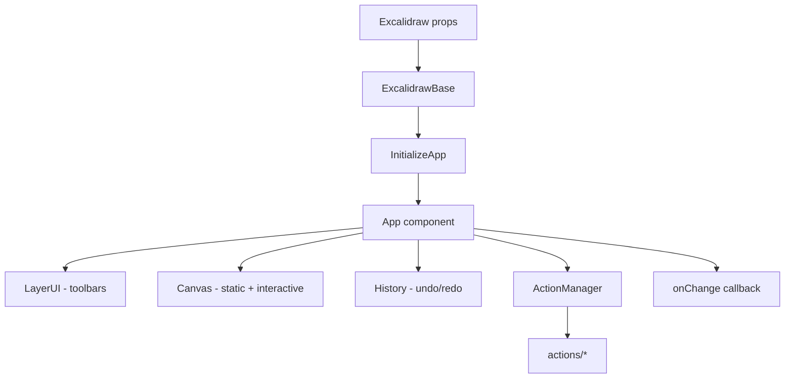

# Editor Internals (`packages/excalidraw`)

The editor is the largest package in the monorepo. It is a self-contained React application exposed as the `<Excalidraw />` component.

## Directory map

```
packages/excalidraw/
├── index.tsx                 # Public API entry — exports Excalidraw + utilities
├── types.ts                  # ExcalidrawProps, AppState, ImperativeAPI types
├── appState.ts               # Default app state, export cleaning
├── editor-jotai.ts           # Editor-internal Jotai store
├── history.ts                # Undo/redo via StoreDelta
├── gesture.ts                # Multi-touch gesture handling
├── scroll.ts                 # Scroll and zoom logic
├── snapping.ts               # Object snap guides
├── clipboard.ts              # Paste/copy parsing
├── cursor.ts                 # Custom cursor rendering
├── i18n.ts                   # Internationalization
├── mermaid.ts                # Mermaid diagram import
├── analytics.ts              # Event tracking
├── polyfill.ts               # Browser polyfills
├── reactUtils.ts             # withBatchedUpdates, etc.
├── workers.ts                # Web worker helpers
├── actions/                  # User action handlers (~40 files)
├── charts/                   # Spreadsheet chart generation
├── components/               # React UI (~200 files)
│   ├── App.tsx               # Core editor component
│   ├── MainMenu.tsx          # Hamburger menu
│   ├── LayerUI.tsx           # Toolbars, panels
│   ├── ColorPicker/          # Color UI
│   ├── FontPicker/           # Font selection
│   ├── Sidebar/              # Collapsible panels
│   ├── CommandPalette/       # Cmd+K palette
│   ├── TTDDialog/            # Text-to-diagram AI
│   └── welcome-screen/       # Empty canvas hints
├── data/                     # Serialization & persistence
│   ├── json.ts               # serializeAsJSON
│   ├── blob.ts               # File load/save
│   ├── restore.ts            # Scene restoration
│   ├── reconcile.ts          # Merge remote elements
│   ├── encode.ts             # Compression
│   ├── encryption.ts         # E2E encryption helpers
│   ├── library.ts            # Shape libraries
│   ├── filesystem.ts         # browser-fs-access wrappers
│   └── image.ts              # Image processing
├── fonts/                    # Font loading & subsetting
│   ├── Fonts.ts              # Font registry
│   ├── ExcalidrawFontFace.ts # FontFace wrapper
│   ├── Virgil/               # Hand-drawn font
│   ├── Cascadia/             # Code font
│   └── [other families]/     # Nunito, Xiaolai, etc.
├── hooks/                    # React hooks
├── renderer/                 # Canvas rendering
│   ├── staticScene.ts        # Non-interactive layer
│   ├── interactiveScene.ts   # Selection handles, cursors
│   ├── renderNewElementScene.ts
│   └── animation.ts          # Animated trails
├── subset/                   # Font subsetting (HarfBuzz WASM)
├── eraser/                   # Eraser tool logic
└── locales/                  # ~50 translation JSON files
```

## Core component flow



### `components/App.tsx`

The heart of the editor (~8000+ lines). Responsibilities:

- Canvas event handling (pointer, keyboard, wheel)
- Tool state machine (selection, rectangle, arrow, freedraw, etc.)
- Scene updates via `updateScene()` and `applyDeltas()`
- Collaborator rendering (cursors, selections)
- Clipboard paste handling (text, images, excalidraw JSON, mermaid, charts)
- File drop handling
- History integration
- Export dialogs

### `ExcalidrawAPIProvider` / `useExcalidrawAPI`

Wraps the editor to expose the imperative API via React context. WebXDC uses this pattern:

```tsx
<ExcalidrawAPIProvider>
  <WebxdcWrapper />  {/* calls useExcalidrawAPI() */}
</ExcalidrawAPIProvider>
```

## State model

### AppState (`types.ts`)

Hundreds of fields covering:

- **Viewport**: `scrollX`, `scrollY`, `zoom`
- **Tool**: `activeTool`, stroke/fill colors, opacity, font
- **Selection**: `selectedElementIds`, `selectedGroupIds`
- **Collaboration**: `collaborators`, `userToFollow`, `followedBy`
- **UI**: `openMenu`, `openSidebar`, theme, zen mode, view mode
- **Grid**: `gridSize`, `gridStep`, `gridModeEnabled`

### Scene elements

Elements live in an ordered array with fractional indices. The editor maintains:

- `sceneElements` — non-deleted elements
- `sceneElementsMap` — id → element lookup
- `files` — `BinaryFiles` map for embedded images

### CaptureUpdateAction

Controls whether `onChange` fires and history records:

| Value | Behavior |
| --- | --- |
| `IMMEDIATELY` | Record history, fire onChange |
| `EVENTUALLY` | Defer history (during drag) |
| `NEVER` | Skip history and onChange (remote sync) |

WebXDC binding uses `NEVER` for remote updates to avoid feedback loops.

## Action system

See [Actions](./actions.md). Actions are registered objects with:

- `name`, `label`, `icon`
- `perform(elements, appState, formData, app)`
- Keyboard shortcut bindings

## Rendering pipeline

See [Rendering](./rendering.md). Two canvas layers:

1. **Static scene** — elements, grid, background
2. **Interactive scene** — selection boxes, resize handles, collaborator cursors

Uses Rough.js for hand-drawn stroke rendering.

## Data flow for changes

```
User input
  → Action.perform() or direct handler
  → mutateElement() / newElement()
  → Store snapshot delta
  → History.push()
  → onChange(elements, appState, files)
  → Host app (WebxdcCollab binding observes via api.onChange)
```

## Key dependencies

| Package | Role in editor |
| --- | --- |
| `roughjs` | Hand-drawn SVG/canvas strokes |
| `perfect-freehand` | Freedraw stroke smoothing |
| `jotai` | Editor UI state atoms |
| `radix-ui` | Accessible UI primitives |
| `@codemirror/*` | Mermaid/code editing |
| `pako` | Compression |
| `nanoid` | Element ID generation |
| `browser-fs-access` | Native file picker |
| `pica` | Image downscaling |

## WebXDC modifications

The WebXDC build does not fork `packages/excalidraw/` source. Instead, `vite-slim-plugin.mts` transforms it at build time:

- Strips i18n to English only
- Removes optional font imports
- Disables mermaid and chart paste handlers in `App.tsx`
- Replaces `fonts.css` with self-hosted subset
- Stubs Help, export, stats, TTD dialogs via `resolveId`

This keeps the editor package identical to upstream while producing a minimal bundle.