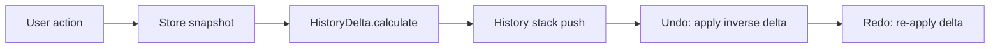

# History & Undo/Redo

Undo/redo is implemented via delta-based history in `packages/excalidraw/history.ts`.

## Architecture



## Core classes

### `HistoryDelta` (extends `StoreDelta`)

Calculates the difference between two store snapshots:

- **Elements delta** — added/removed/changed elements
- **AppState delta** — changed app state fields

```ts
HistoryDelta.calculate(prevSnapshot, nextSnapshot);
delta.applyTo(elements, appState, fallbackSnapshot);
```

### `History` class

Manages undo/redo stacks:

- `push(delta)` — add to undo stack, clear redo
- `undo()` — pop undo, push to redo
- `redo()` — pop redo, push to undo
- `clear()` — reset both stacks

Accessible via `excalidrawAPI.history.clear()`.

## Store system

History builds on the element `Store` (`packages/element/`):

- `StoreSnapshot` — point-in-time elements + app state
- `StoreDelta` — incremental change set
- `StoreChange` — individual property change

## Collaboration interaction

During collaboration, history handles remote changes differently:

- Remote updates use `CaptureUpdateAction.NEVER` — no history entry
- Undo/redo excluded properties: `version`, `versionNonce` (each undo creates new versions)
- `HistoryDelta.applyTo` falls back to local snapshot for force-deleted elements

## Yjs undo (WebXDC potential)

`ExcalidrawBinding` accepts optional `undoConfig` with `Y.UndoManager`, but WebXDC does not currently enable it. Undo/redo in WebXDC uses the local history stack only — remote changes are not undoable.

## Keyboard shortcuts

| Action | Shortcut |
| --- | --- |
| Undo | Ctrl+Z / Cmd+Z |
| Redo | Ctrl+Shift+Z / Cmd+Shift+Z |

Defined in `actions/shortcuts.ts`.

## History during drag operations

While dragging elements:

1. Changes use `CaptureUpdateAction.EVENTUALLY`
2. History entry created on pointer up (finalize)
3. Intermediate positions don't create undo steps

This prevents hundreds of undo entries during a single drag.