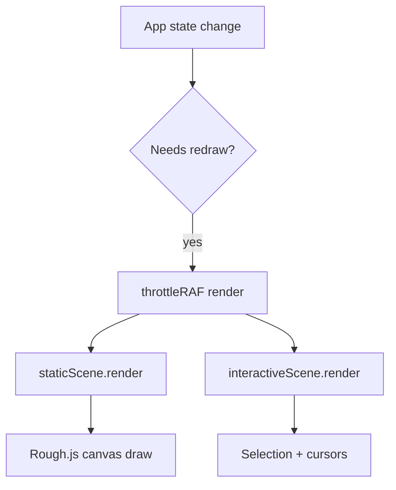

# Rendering Pipeline

Excalidraw renders to HTML Canvas using a two-layer approach in `packages/excalidraw/renderer/`.

## Canvas layers

| Layer | Module | Contents |
| --- | --- | --- |
| Static | `staticScene.ts` | Elements, grid, background, frames |
| Interactive | `interactiveScene.ts` | Selection handles, transform widgets, collaborator cursors |
| New element | `renderNewElementScene.ts` | Element being drawn (preview) |

## Rendering flow

### Rough.js

Hand-drawn aesthetic comes from [Rough.js](https://roughjs.com/):

- Each element's `seed` produces consistent sketch randomness
- `roughness`, `strokeStyle`, `fillStyle` control appearance
- Canvas renderer used for live editing; SVG renderer for export

### Element rendering

`packages/element/src/renderElement.ts` dispatches by element type:

- Shapes → Rough.js paths
- Text → Canvas `fillText` with loaded fonts
- Images → `drawImage` with status handling
- Freedraw → `perfect-freehand` outline fill
- Arrows → Custom path with bindings

### Collaborator cursors

When `isCollaborating={true}`, the interactive layer renders:

- Remote pointer positions (colored per user)
- Selection highlights on remote-selected elements
- Username labels
- Laser pointer trails (via `@excalidraw/laser-pointer`)

WebXDC feeds collaborator data through `WebxdcRealtimeChannel` → `api.updateScene({ appState: { collaborators } })`.

## Animation

`animatedTrail.ts` and `renderer/animation.ts` handle:

- Laser pointer trails
- Animated selection feedback

## Font rendering

Before text renders, fonts must load via `Fonts.ts`:

1. Check if font family is registered
2. Load WOFF2 via `ExcalidrawFontFace`
3. Optionally subset via HarfBuzz WASM (`subset/`)

WebXDC only bundles Virgil (drawing) and Assistant (UI).

## Export rendering

Export uses separate code paths in `@excalidraw/utils`:

- `exportToCanvas` — rasterize to Canvas
- `exportToSvg` — generate SVG with Rough.js SVG renderer
- `exportToBlob` — canvas → PNG/JPEG Blob

These are available in the npm package but export dialogs are stubbed in WebXDC.

## Performance considerations

- `throttleRAF` batches render requests to animation frames
- Static scene only redraws when elements change
- Interactive scene redraws on pointer/selection changes
- Element version checks skip unchanged elements
- Font subsetting reduces payload size

## Visual debug

`packages/element/src/visualdebug.ts` (exported as `@excalidraw/element/visualdebug`) provides debug overlays for bounding boxes and binding points. Enabled via debug flags in development.