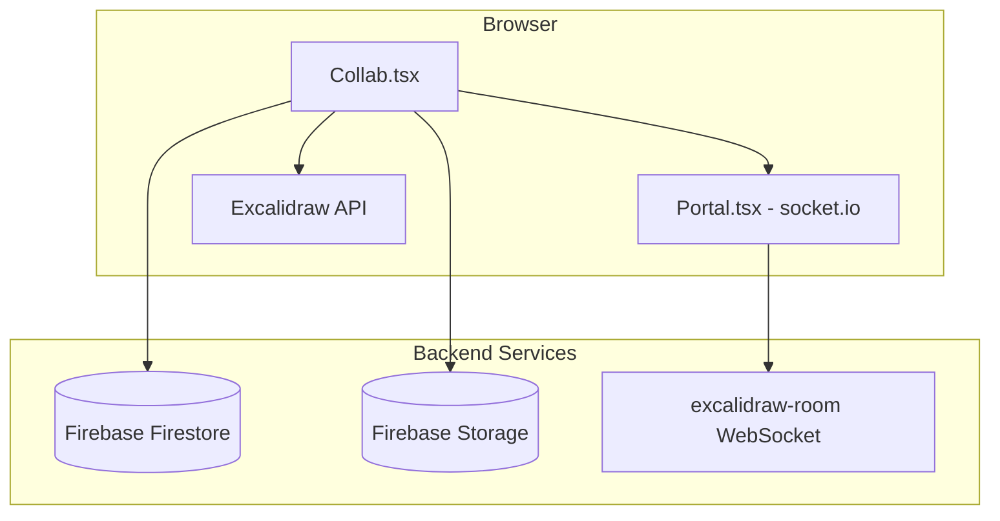

# Standard Collaboration (Firebase + Socket.io)

The excalidraw.com collaboration system in `excalidraw-app/collab/`. **Not used in WebXDC.**

## Architecture



## Components

### `Collab.tsx`

Class component (~1000 lines) managing:

- Room creation and joining via URL hash
- Firebase document load/save
- Socket.io realtime sync
- Image file upload to Firebase Storage
- Collaborator cursor/idle/viewport sync
- Follow mode
- Error handling and reconnection

### `Portal.tsx`

Socket.io client wrapper. Emits/receives typed messages.

### `atoms.ts`

Jotai atoms shared with WebXDC:

| Atom | Type | Purpose |
| --- | --- | --- |
| `collabAPIAtom` | `CollabAPI \| null` | Imperative collab interface |
| `isCollaboratingAtom` | `boolean` | Collab mode flag |
| `activeRoomLinkAtom` | `string \| null` | Current room URL |
| `isOfflineAtom` | `boolean` | Network status |

WebXDC sets these same atoms so editor collab UI works.

### `CollabAPI` interface

```ts
type CollabAPI = {
  isCollaborating: () => boolean;
  onPointerUpdate: PointerHandler;
  startCollaboration: () => Promise<ImportedDataState>;
  stopCollaboration: () => void;
  syncElements: (elements) => void;
  fetchImageFilesFromFirebase: (opts) => Promise<ImageResult>;
  setUsername: (name) => void;
  getUsername: () => string;
  getActiveRoomLink: () => string | null;
  setCollabError: (error) => void;
};
```

WebXDC implements a subset — Firebase methods are no-ops.

## Room links

Format: `https://excalidraw.com/#room=<roomId>,<roomKey>`

- `roomId` — 10 random bytes as hex
- `roomKey` — 22-char encryption key

Parsed by `getCollaborationLinkData()` in `data/index.ts`.

## Socket message types

From `collab/socket-types.ts` and `app_constants.ts`:

| Subtype | Payload |
| --- | --- |
| `SCENE_INIT` | Full element list |
| `SCENE_UPDATE` | Partial element updates |
| `MOUSE_LOCATION` | Cursor position, selection, username |
| `IDLE_STATUS` | User idle/active/away state |
| `USER_VISIBLE_SCENE_BOUNDS` | Viewport for follow mode |

### WebSocket events

```ts
WS_EVENTS = {
  SERVER_VOLATILE: "server-volatile-broadcast",
  SERVER: "server-broadcast",
  USER_FOLLOW_CHANGE: "user-follow",
  USER_FOLLOW_ROOM_CHANGE: "user-follow-room-change",
}
```

## Firebase integration

### Firestore

- Document per room ID
- Encrypted scene data
- Periodic full scene sync (`SYNC_FULL_SCENE_INTERVAL_MS` = 20s)

### Storage

- Image files at `/files/rooms/<roomId>/`
- Share link files at `/files/shareLinks/`
- Max upload: 4 MiB (`FILE_UPLOAD_MAX_BYTES`)

## Timing constants

| Constant | Value | Purpose |
| --- | --- | --- |
| `INITIAL_SCENE_UPDATE_TIMEOUT` | 5s | Wait for first scene |
| `CURSOR_SYNC_TIMEOUT` | 33ms | ~30fps cursor broadcast |
| `SYNC_FULL_SCENE_INTERVAL_MS` | 20s | Periodic full sync |
| `LOAD_IMAGES_TIMEOUT` | 500ms | Image load timeout |
| `DELETED_ELEMENT_TIMEOUT` | 24h | Purge deleted elements |

## Encryption

Room data encrypted with key from URL hash:

```ts
import { encryptData, decryptData, generateEncryptionKey } from ".../encryption";
```

WebXDC relies on Delta Chat's built-in encryption instead.

## Comparison with WebXDC collab

| Aspect | Standard | WebXDC |
| --- | --- | --- |
| Document store | Firebase Firestore | Yjs CRDT |
| Realtime | Socket.io | Delta Chat realtime channel |
| Persistence | Firebase + encrypted | sendUpdate status messages |
| Images | Firebase Storage | Yjs assets map + sendUpdate |
| Room creation | URL hash link | Attach .xdc to chat |
| E2E encryption | App-level AES | Delta Chat transport |
| History replay | Firebase load | setUpdateListener |