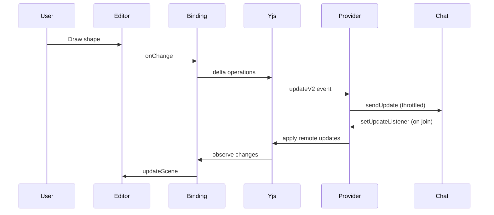

# Storage & Persistence

How data is stored across different modes.

## Storage layers overview

| Layer | Standard App | WebXDC |
| --- | --- | --- |
| Scene elements | localStorage + Firebase | Yjs (via sendUpdate) |
| App state | localStorage | Yjs sceneSettings + local theme |
| Images | Firebase Storage + IndexedDB | Yjs assets map |
| Shape library | IndexedDB | Not available |
| Theme | localStorage | localStorage + IndexedDB |
| Username | localStorage | webxdc.selfName |
| TTD chats | IndexedDB | Not available |

## localStorage keys

From `app_constants.ts` → `STORAGE_KEYS`:

| Key | Content |
| --- | --- |
| `excalidraw` | Serialized scene elements |
| `excalidraw-state` | App state (viewport, colors) |
| `excalidraw-collab` | Collaboration preferences |
| `excalidraw-theme` | `"light"` or `"dark"` |
| `excalidraw-debug` | Debug flags |

### Autosave timing

Standard app saves to localStorage with `SAVE_TO_LOCAL_STORAGE_TIMEOUT` = 300ms debounce.

## IndexedDB stores

| Store name | Key | Content |
| --- | --- | --- |
| `excalidraw-library` | library items | Shape libraries |
| `excalidraw-ttd-chats` | chat ID | Text-to-diagram history |
| `excalidraw-webxdc-settings` | `theme` | WebXDC theme preference |

Uses `idb-keyval` for simple key-value access.

## Firebase (standard app only)

### Firestore

Room documents store encrypted scene data. Accessed via `data/firebase.ts`:

- `saveToFirebase(roomId, elements, appState)`
- `loadFromFirebase(roomId, roomKey)`
- `isSavedToFirebase(roomId)`

### Firebase Storage

Image files uploaded via `data/FileManager.ts`:

- `saveFilesToFirebase({ files, roomId })`
- `loadFilesFromFirebase({ roomId, fileIds })`

Prefixes from `FIREBASE_STORAGE_PREFIXES`:

- `/files/rooms` — collaboration images
- `/files/shareLinks` — share link images

## WebXDC persistence

### Yjs document (canonical)

The authoritative store is the Yjs `Y.Doc`:

```
ydoc
├── elements: Y.Array<Y.Map>    ← element properties
├── assets: Y.Map               ← image binary data
└── sceneSettings: Y.Map        ← background, grid, theme
```

### y-webxdc provider

`WebxdcProvider` from `y-webxdc`:

- Serializes Yjs updates to `webxdc.sendUpdate()`
- Replays via `webxdc.setUpdateListener()`
- `autosaveInterval` from `sendUpdateInterval` (min 3s)
- `syncToChatPeers()` for manual flush

### Chat history

All `sendUpdate` messages in the chat form an append-only log. New participants replay the full log to reconstruct the Yjs document.

### Image handling

Images are too large for the realtime channel:

```ts
yAssets.observe(() => {
  if (origin === binding) {
    provider.syncToChatPeers();  // immediate persist
  }
});
```

## Browser tab sync

`data/tabSync.ts` — synchronizes localStorage across tabs in the standard app via `BroadcastChannel`. Not used in WebXDC.

## Editor local storage

`packages/excalidraw/data/EditorLocalStorage.ts` — editor-internal preferences separate from app storage.

## Data lifecycle in WebXDC

