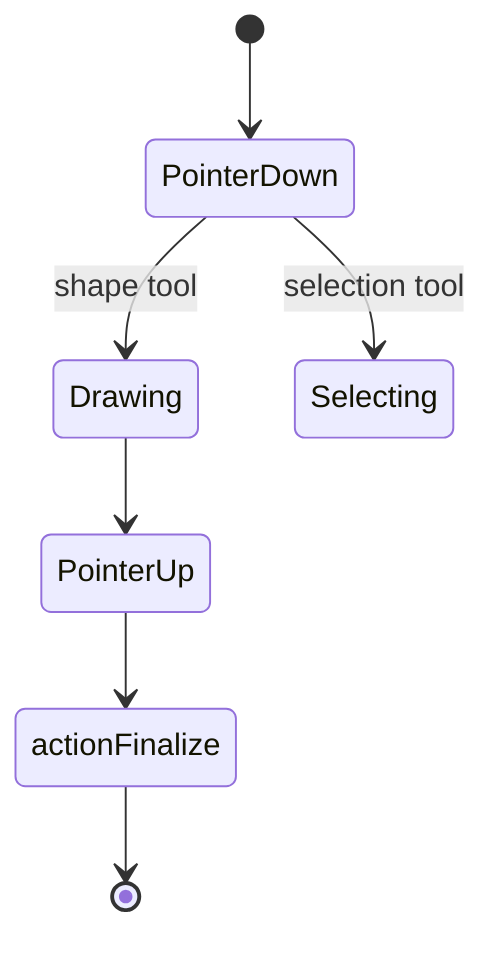

# Drawing Tools

Tools are represented by `ActiveTool` in `packages/excalidraw/types.ts`:

```ts
type ToolType =
  | "selection" | "lasso"
  | "rectangle" | "diamond" | "ellipse"
  | "arrow" | "line" | "freedraw"
  | "text" | "image"
  | "eraser" | "hand"
  | "frame" | "magicframe"
  | "embeddable" | "laser";
```

## Tool state

```ts
activeTool: {
  type: ToolType;
  customType: null;
  lastActiveTool: ActiveTool | null;  // revert target for eraser/hand
  locked: boolean;                     // Q to toggle
  fromSelection: boolean;              // temporarily switched from selection
}
```

Set via `excalidrawAPI.setActiveTool({ type: "rectangle" })`.

## Tool reference

| Tool | Behavior | Key modules |
| --- | --- | --- |
| **selection** | Select, move, resize elements | `selection.ts`, `resizeElements.ts` |
| **lasso** | Freeform selection area | `selection.ts` |
| **rectangle** | Draw rectangles | `newElement.ts`, `shape.ts` |
| **diamond** | Draw diamonds | `newElement.ts`, `shape.ts` |
| **ellipse** | Draw ellipses/circles | `newElement.ts`, `shape.ts` |
| **arrow** | Arrows with bindings | `linearElementEditor.ts`, `binding.ts`, `elbowArrow.ts` |
| **line** | Multi-point lines | `linearElementEditor.ts` |
| **freedraw** | Freehand strokes | `perfect-freehand`, `newElement.ts` |
| **text** | Text elements | `textElement.ts`, `textWrapping.ts` |
| **image** | Place images | `image.ts`, `data/blob.ts` |
| **eraser** | Erase elements | `eraser/index.ts` |
| **hand** | Pan viewport | `scroll.ts` |
| **frame** | Grouping frames | `frame.ts` |
| **magicframe** | AI generation frame | `frame.ts`, TTD integration |
| **embeddable** | Embed external content | `embeddable.ts` |
| **laser** | Laser pointer (collab) | `@excalidraw/laser-pointer` |

## Drawing flow



1. `pointerdown` on canvas → start new element or selection
2. `pointermove` → update dimensions/points
3. `pointerup` → `actionFinalize` commits element
4. History records with `CaptureUpdateAction.IMMEDIATELY` or `EVENTUALLY`

## Tool-specific settings

Stored in `AppState` as `currentItem*` fields:

| Setting | AppState field |
| --- | --- |
| Stroke color | `currentItemStrokeColor` |
| Background color | `currentItemBackgroundColor` |
| Stroke width | `currentItemStrokeWidthKey` |
| Fill style | `currentItemFillStyle` |
| Roughness | `currentItemRoughness` |
| Opacity | `currentItemOpacity` |
| Font family | `currentItemFontFamily` |
| Font size | `currentItemFontSize` |
| Arrow type | `currentItemArrowType` (`sharp` / `round` / `elbow`) |
| Roundness | `currentItemRoundness` |

## Snapping

`packages/excalidraw/snapping.ts` provides guide snapping when drawing and moving. Enabled when `objectsSnapModeEnabled` is true (`Alt+S`).

## Eraser

`packages/excalidraw/eraser/` — marks elements as deleted or removes partial freedraw points. Temporarily switches from previous tool (stored in `lastActiveTool`).

## Laser pointer (collaboration)

Uses `@excalidraw/laser-pointer` for trail rendering. In WebXDC, laser positions sync via realtime `pos` messages with `tl: "laser"`.

## WebXDC availability

All core drawing tools work in WebXDC. Disabled/stubbed:

- **magicframe** / TTD — stubbed
- **embeddable** — available but limited in WebView
- **Mermaid import** — disabled via paste handler transform
- **Chart paste** — disabled