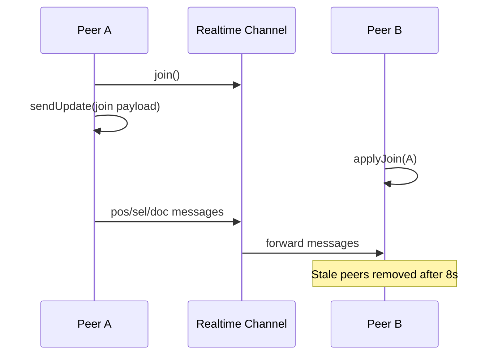

# WebXDC Realtime Protocol

The P2P realtime channel defined in `webxdc-realtime-channel.ts`.

## Backward compatibility

`onRealtimeData()` accepts two formats:

1. **JSON messages** (current) — first byte is `0x7b` (`{`)
2. **Raw Yjs bytes** (legacy peers) — applied directly via `deliverDocumentUpdate()`

## Transport

Uses Delta Chat's `joinRealtimeChannel()` API:

```ts
const channel = webxdc.joinRealtimeChannel();
channel.setListener((data: Uint8Array) => { /* handle */ });
channel.send(data: Uint8Array);
channel.leave();
```

- Payloads must be `Uint8Array`
- Max size: `sendUpdateMaxSize` (default 128,000 bytes)
- Requires Delta Chat 1.48+ with realtime enabled

## Message format

All messages are JSON encoded as UTF-8 bytes:

```ts
type RealtimeMessage =
  | PosMessage    // { t: "pos", ... }
  | SelMessage    // { t: "sel", ... }
  | DocMessage    // { t: "doc", ... }
  | VpMessage     // { t: "vp", ... }
  | FolMessage    // { t: "fol", ... }
  | UnfolMessage  // { t: "unfol", ... }
```

Short keys minimize payload size.

## Message types

### `pos` — Cursor position

```json
{
  "t": "pos",
  "a": "user@addr",
  "n": "Display Name",
  "c": "#30bced",
  "cl": "#30bced33",
  "x": 123.4,
  "y": 567.8,
  "b": "down",
  "tl": "pointer"
}
```

| Field | Description |
| --- | --- |
| `a` | Sender address |
| `n` | Display name |
| `c` | Cursor color |
| `cl` | Light cursor color (with alpha) |
| `x`, `y` | Scene coordinates |
| `b` | Button state: `"down"` or `"up"` |
| `tl` | Tool: `"pointer"` or `"laser"` |

Sent at ~30fps (`CURSOR_SEND_INTERVAL_MS` = 33ms). Immediate flush on pointer down.

### `sel` — Selection

```json
{
  "t": "sel",
  "a": "user@addr",
  "s": { "element-id-1": true, "element-id-2": true }
}
```

Broadcasts selected element IDs for remote selection indicators.

### `doc` — Document update

```json
{
  "t": "doc",
  "d": "<base64-encoded-yjs-update>"
}
```

Contains a merged Yjs update (`mergeUpdatesV2`). Applied with:

```ts
applyUpdateV2(ydoc, data, "webxdc-realtime-doc");
```

Throttled at 80ms (`REALTIME_DOC_MS`). Flushed immediately on pointer down.

### `vp` — Viewport bounds

```json
{
  "t": "vp",
  "a": "user@addr",
  "b": [minX, minY, maxX, maxY]
}
```

Sent when a followed user scrolls/zooms. Receiver applies `zoomToFitBounds()`.

### `fol` / `unfol` — Follow notifications

```json
{ "t": "fol", "a": "follower@addr", "f": "followed@addr" }
{ "t": "unfol", "a": "follower@addr", "f": "followed@addr" }
```

Tells a peer to start/stop sending viewport updates.

## Join protocol (via sendUpdate)

Peer presence uses `sendUpdate`, not realtime:

```json
{
  "payload": {
    "type": "join",
    "addr": "user@addr",
    "name": "Display Name",
    "color": "#30bced",
    "colorLight": "#30bced33"
  }
}
```

Handled by `createWebxdcSyncBridge.onJoin` → `realtime.applyJoin()`.

## Peer lifecycle



### Stale peer removal

`STALE_MS` = 8,000ms. Peers without activity are removed and collaborator UI updated.

## Fallback chain

```
1. Try realtime channel for live drawing
   ↓ fails or unavailable
2. Fall back to sendUpdate (y-webxdc WebxdcProvider)
   ↓ image too large for realtime
3. Immediate syncToChatPeers() for assets
```

## Dev shim behavior

`public/webxdc.js` implements realtime via `BroadcastChannel("webxdc-realtime-shim")`:

- Works for single-browser multi-tab testing
- **Not suitable for multi-peer testing** — use `make run-sim` instead
- `webxdc-dev` provides proper WebSocket-based multi-peer simulation

## Counters

`WebxdcCollab` tracks these for debugging:

| Counter | Source |
| --- | --- |
| `realtimeDocSent/Received` | `doc` messages |
| `realtimeCursorSent/Received` | `pos` messages |
| `sendUpdateSent/Received` | y-webxdc persistence |