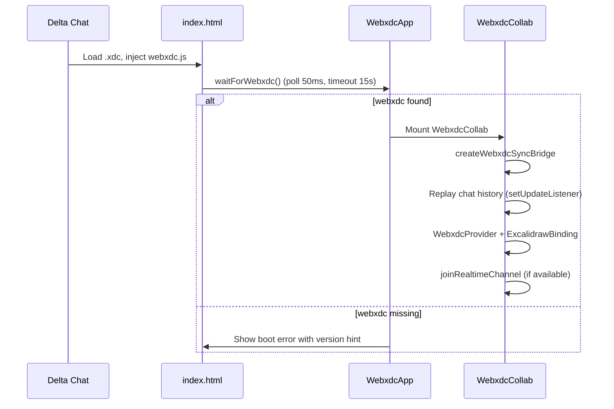

# WebXDC Integration

This document covers the Delta Chat WebXDC variant: how it is built, developed, and deployed.

## What is WebXDC?

[WebXDC](https://webxdc.org) is a format for portable web apps that run inside messengers like Delta Chat. An `.xdc` file is a ZIP archive containing HTML, JS, CSS, and a `manifest.toml`.

This project produces **`excalidraw.xdc`** — a collaborative whiteboard that syncs drawing state through the chat.

## Manifest

`excalidraw-app/manifest.toml`:

```toml
name = "Excalidraw"
description = "Collaborative whiteboard for Delta Chat, synced with Yjs."
version = "1.0.4"
author = "Delta Exil"
icon = "android-chrome-192x192.png"
```

Version is bumped automatically by `make build-webxdc` (via `WEBXDC_VERSION`).

## File structure

```
excalidraw-app/webxdc/
├── index.html              # Vite HTML entry
├── index.tsx               # Boot: waitForWebxdc → render WebxdcApp
├── WebxdcApp.tsx           # Excalidraw shell (always collaborating)
├── WebxdcCollab.tsx        # Yjs + y-webxdc + realtime orchestration
├── WebxdcMainMenu.tsx      # Slimmed main menu (image import, theme)
├── webxdc-realtime-channel.ts  # P2P live drawing + cursors
├── collab-status.ts        # Sync status atom + webxdc bridge
├── get-webxdc.ts           # window.webxdc detection
├── constants.ts            # Timing constants
├── version.ts              # Build version
├── import-image.ts         # Image import via webxdc.importFiles
├── theme-storage.ts        # Theme persistence
├── useWebxdcAppTheme.ts    # Theme hook
├── pointer-ref.ts          # Pointer update ref for collab
├── y-excalidraw/           # Excalidraw ↔ Yjs binding
│   ├── index.ts            # ExcalidrawBinding class
│   ├── diff.ts             # Delta operations
│   ├── helpers.ts          # Conversion utilities
│   ├── cursor-sync.ts      # Collaborator cursor state
│   └── scene-settings.ts   # Background, grid sync
├── stubs/                  # Empty modules for stripped features
├── webxdc-stub.js          # Minimal webxdc.js for .xdc zip
├── webxdc-dev-plugin.mts   # Vite dev plugin
├── webxdc-pack-plugin.mts  # Post-build HTML flattening
└── vite-slim-plugin.mts    # Bundle size reduction
```

## Boot sequence



### Boot error handling

If `window.webxdc` is not found, the app shows a user-facing error suggesting:

- Delete old Excalidraw attachments in the chat
- Attach a fresh `excalidraw.xdc` and open the new message

## Development

### Prerequisites

- Bun 1.3+
- `webxdc-dev` CLI (installed as dev dependency)

### Single-user dev (`make run`)

Runs Vite only on port 3000 with a mocked `webxdc.js`:

```bash
make run
# Open http://localhost:3000/webxdc/
```

Uses `mockWebxdc` plugin with `public/webxdc.js`. Sync uses **BroadcastChannel** — suitable for single-tab testing only.

### Multi-peer simulator (`make run-sim`)

Runs Vite + `webxdc-dev` side-by-side peer simulator:

```bash
make run-sim
# Open http://localhost:7100
```

Two chat instances open side-by-side. Drawing in one panel appears in the other via WebSocket realtime. **Use this for multi-peer testing**, not `make run`.

Environment variables:

| Variable | Default | Purpose |
| --- | --- | --- |
| `VITE_DEV_PORT` | 3000 | Vite dev server port |
| `WEBXDC_DEV_PORT` | 7100 | webxdc-dev simulator port |

### npm/bun scripts

```bash
bun run dev:webxdc          # Same as make run-sim
bun run dev:webxdc:vite     # Vite only (used by make run)
bun run build:webxdc        # Production .xdc build
```

## Building the .xdc package

```bash
make build-webxdc
# Output: excalidraw-app/dist-xdc/excalidraw.xdc
```

Override version:

```bash
make build-webxdc WEBXDC_VERSION=1.0.5
```

### Build steps

1. Set `VITE_APP_WEBXDC=true`
2. Vite builds to `excalidraw-app/build-webxdc/`
3. `webxdcSlimPlugin` strips unused assets and stubs features
4. `webxdcPackPlugin` flattens HTML, injects `webxdc.js` script tag before app bundle
5. `buildXDC` zips filtered files into `dist-xdc/excalidraw.xdc`

### Size optimizations

The slim plugin (`vite-slim-plugin.mts`) removes or stubs:

| Feature | Action |
| --- | --- |
| Mermaid diagrams | Stubbed |
| Charts / spreadsheets | Stubbed |
| Help / export / stats dialogs | Null component |
| All locales except English | Stripped |
| Extra fonts (Cascadia, Nunito, etc.) | Stripped |
| CodeMirror, KaTeX, QR code chunks | Excluded from bundle |
| PWA service worker | Stubbed |
| Sentry, Firebase, socket.io | Empty module stubs |
| Screenshots, promo images | Excluded from zip |

Only **Virgil** (hand-drawn) and **Assistant** (UI) fonts are bundled, self-hosted for CSP `font-src 'self'`.

## WebXDC API usage

The app uses these Delta Chat WebXDC APIs:

| API | Usage |
| --- | --- |
| `selfAddr` / `selfName` | User identity for cursors and Yjs |
| `sendUpdate` | Persist Yjs state to chat (via y-webxdc) |
| `setUpdateListener` | Replay chat history on join |
| `sendUpdateInterval` | Autosave interval (min 3s) |
| `sendUpdateMaxSize` | Max update payload size |
| `joinRealtimeChannel` | P2P live sync (optional) |
| `importFiles` | Image picker for canvas |
| `sendToChat` | (available via bridge, not primary sync) |
| `getAllUpdates` | (available via bridge) |

### Frozen API bridge

Delta Chat exposes a frozen `window.webxdc` object. The app wraps it in `createWebxdcSyncBridge()` (`collab-status.ts`) — a plain delegate object safe to pass to `y-webxdc` without mutating host methods.

## UI differences from standard app

`WebxdcApp.tsx` configures Excalidraw with:

- `isCollaborating={true}` always
- `langCode="en"` (i18n stripped)
- `detectScroll={false}` (WebView scroll handling)
- `handleKeyboardGlobally={true}` (keyboard in WebView)
- Slim main menu: search, insert image, help, clear, preferences, theme, background

## Deploying to Delta Chat

1. Build: `make build-webxdc`
2. Attach `excalidraw-app/dist-xdc/excalidraw.xdc` to a Delta Chat message
3. Open the attachment — all chat members can draw together
4. For live cursors/drawing: enable realtime in Delta Chat Advanced settings (1.48+)

### Upgrading users

When releasing a new version, users should delete old Excalidraw attachments and attach the new `.xdc`. The boot error message guides users through this when `window.webxdc` fails to initialize.